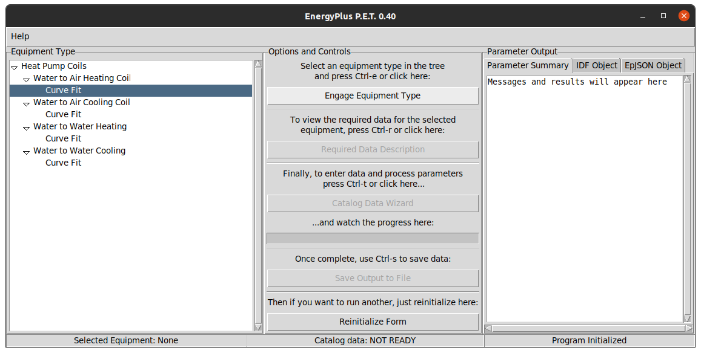
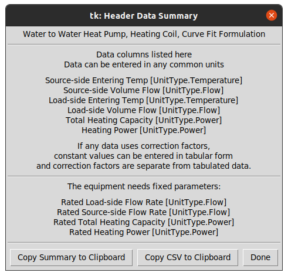
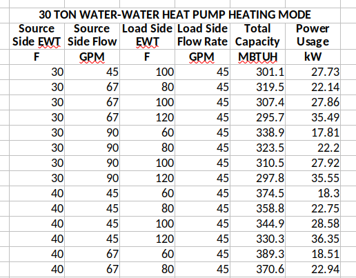
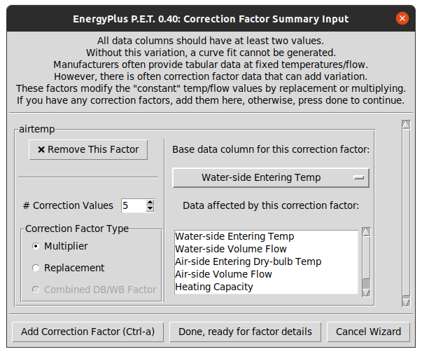
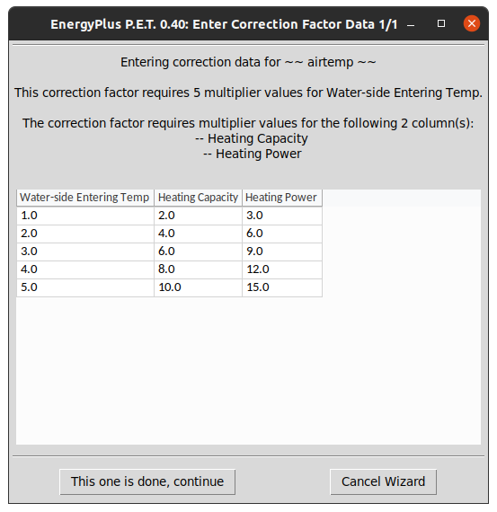
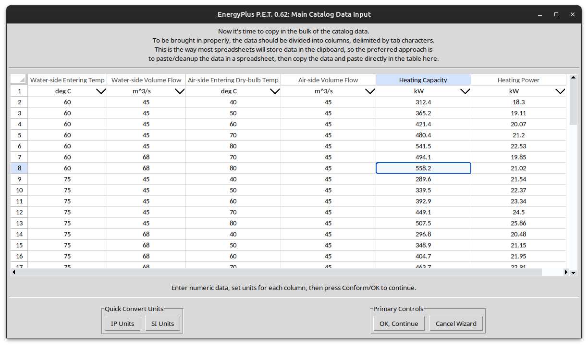
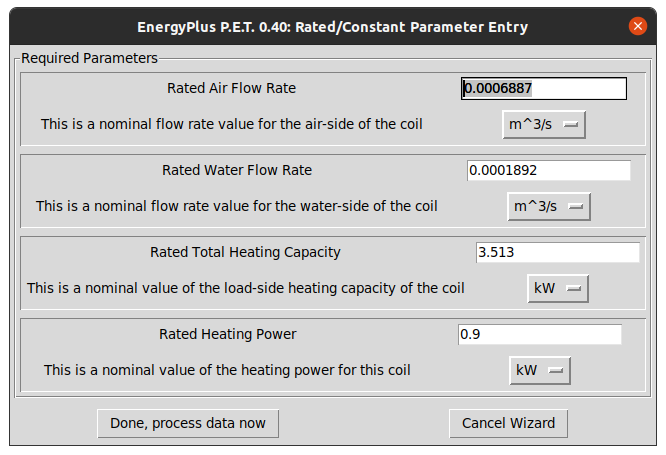
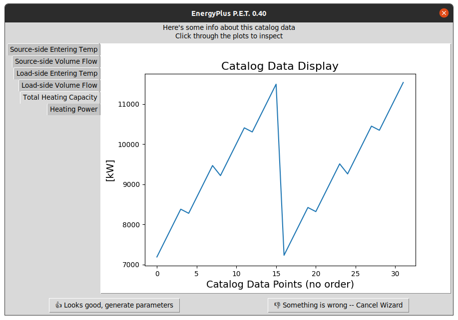
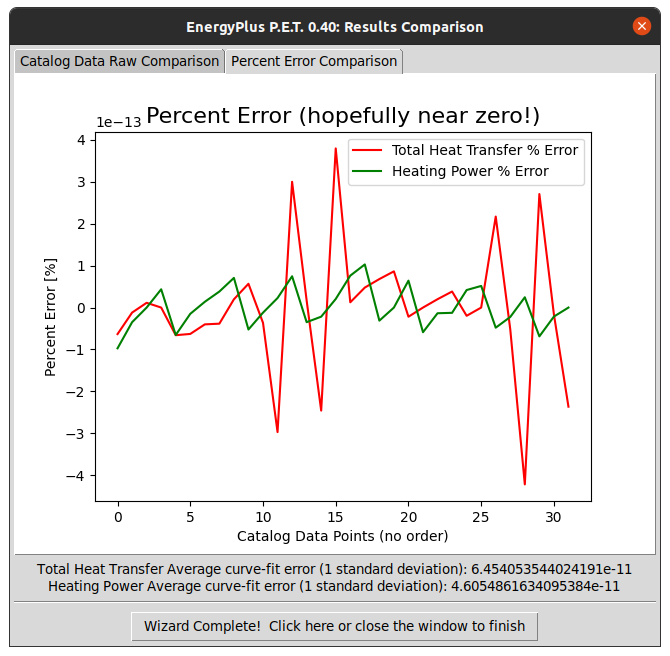
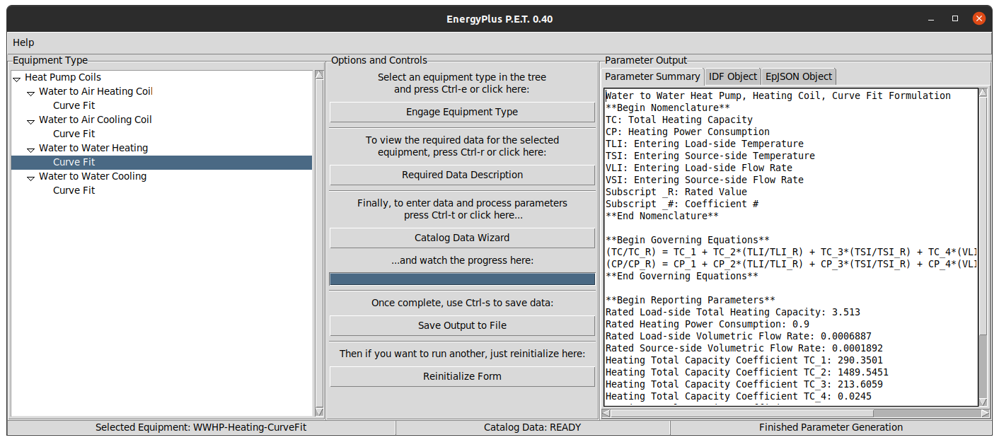

Walk-through and forms information
==================================

The program attempts to navigate the user through the process in a straightforward manner.
This guide will simply provide some additional information and point out specific features of each form.

For developers, there are also specific pages for each form to understand what is going on behind the scenes:

.. toctree::
   :maxdepth: 2
   :caption: Contents:

   main
   header_preview
   correction_summary_form
   correction_summary_widget
   correction_detail_form
   base_data_form
   catalog_plot
   constant_parameters
   comparison_plot
   basic_message_form

The program begins with the main form:

The form is laid out pretty simply, with a list of available component types in the left tree, a set of controls in
the middle, and a set of output windows on the right.  The Help menu has options to open the online documentation in
a browser, as well as opening the example data folder that is packaged with the tool.  A newer addition to the menu is
also the capability to generate a shortcut icon on the system's desktop to make it very easy to launch the program.

To continue to generate parameters, the first step is to select a valid equipment type entry in the left tree, and
clicking the *Engage Equipment Type* button.  Clicking this with an invalid entry in the tree will emit a dialog.
Once a valid entry is engaged, the buttons for previewing the *Required Data Description* and running the
*Catalog Data Wizard* will be enabled.

The required data preview is a useful way to see what information is needed to describe the selected component type:

For this particular type of equipment, the form previews that the data needed to perform parameter estimation includes
6 columns of data including entering temperature and flow rates (independent variables) and heating capacity and
power consumption (dependent variables).  In addition, the user is expected to provide four fixed/rated/reference
parameters which are used for scaling the data and generating full outputs.

One convenient option on this form is copying the data as a csv blob.  By copying this and then pasting into a
spreadsheet, it becomes clear what tabular and parameter data are needed, and if this is used as the basis for
preparing data, the columns will already be in the right order, etc.

Once the required data is defined, the next step is gathering data from an equipment data sheet.  In many cases, the
data will only be available as a table in a PDF document, so it is advised to copy and paste into a text editor or
directly into a spreadsheet to allow massaging the data into the right columns.  Although this part is a bit annoying,
it tends to only take a few tedious minutes, and will make it much easier to paste the data into this tool.  Once
prepared, the data might look something like this in your own spreadsheet:

The data has been prepared in the correct column order.  Note that up until now, there has been no mention of specific
units.  That is because this tool is quite flexible in what units the data are pasted.  There are utilities on each
form to ensure that the units are in the correct calculation unit before proceeding to the next step.

The next topic is about correction factors.  It is common for manufacturers to provide performance data while holding
some parameters constant.  For example, the table data varies all parameters, but assumes the air flow rate is fixed
at 300 CFM.  This is fine for some design calculations, but in the context of an EnergyPlus simulation, the flow rate
may not be at 300 CFM, and the model formulation for the component may require a variation of flow rate in order to
generate coefficients.  To accommodate this, most manufacturers will provide correction factor information at the end
of the tabular data.  This is simply a set of multipliers or replacement values for the independent variables, and
multipliers for each dependent variable.  Continuing with the example, the correction factor may have multipliers
against the "fixed" air flow rate of 0.8, 0.9, 1.0, 1.1, and 1.2, with multipliers for heat transfer and power at each
correction as well.  These correction factors can be used to generate a large data set that has variation in each
variable.

To begin entering correction factors, the user is expected to provide summaries of each on the summary form:

On this form the user adds correction factors as needed.  For each correction factor, the user defines the number
of rows in the correction factor table, the type of correction factor, the base column (the column held constant in
the core tabular data), and which variables are modified by the correction factor (usually all dependent variables).

Once all correction factor summaries have been entered, the next step is actually pasting in the correction factor
detailed tabular data.  As with the core data described earlier, it is often worth the few minutes it takes to copy
and paste the data from the catalog document into a spreadsheet and clean it up, making it ready to paste into this
tool.  When that is ready, enter the data into the detail form:

The correction factor detail form will look a little different depending on the type of correction factor.  For a
multiplier type, the tabular data is filled with multipliers, so there is no need to concern with unit systems.  Once
the data is ready, you can just continue.

If the correction factor type is replacement or combined wb/db replacement, the base column(s) will contain replacement
values for the original fixed value.  Because of this, the data pasted in might be in the wrong unit system.  The user
can specify the data units on the form, and if it is the wrong type, the form will first conform the data into the
correct units prior to continuing the wizard.

Once the correction factor data is completed, the next step is entering the main data:

This form is quite busy, and rightfully so, as this where the user pastes in the majority of the input data.
The most ideal workflow here is to have the data prepared in the right columns in a spreadsheet.  If that is the
situation, then the user can simply copy the full table data, select the top left cell in this form, and ctrl-v to
paste it right in.  Nice.  If not, the user can enter the data however needed.  For manual entry, there are buttons on
the form to add more rows, and once complete, if there are extra rows, there is a button to shrink the table down and
eliminate blank rows.

The data coming from a catalog will likely be in a mixed set of units.  For convenience there are buttons
to quickly set the unit headers to IP or SI typical units.  Regardless of how the units are set, the user should take
time to make sure the dropdowns on each column match the units of the numeric data pasted into the table.  Once
that is set properly, the form will need to conform any units to the preferred calculation unit before continuing.

The final user input is the rated/fixed/reference/constant values that are required for the specified equipment type:

This form is straightforward.  The user should provide the values in whatever units they would like, and the form will
conform the data into the proper units before continuing the wizard.

At this point, data entry is complete!  Just a few pastes and specifying units, not too bad, right?  Time to do a quick
check on the entered data.  The data manager has internally applied any correction factors and built out a full data
set that *should* have variation in each column of data.  The tool will show quick plots of the final data set to allow
the user to confirm:

By clicking through these plots, the user can visualize the variation of each column of data.  If any plot is perfectly
horizontal, that implies that this column does not have any variation, and the parameter generation will likely fail!

Once satisfied, the wizard will now run the parameter estimation behind the scenes to generate the coefficients for
the equipment model.  If this succeeds, the new model formulation can be applied to the full catalog data set to see
just how close the model coefficients can predict the equipment outputs.  That is shown on two plots in the comparison
form:

There are two plots on this form, a comparison plot and a percent error plot.  First the comparison plot.  On this plot,
data points are plotted directly from the catalog data, and a line is plotted with our predicted model outputs at the
same catalog input data.  This is a comparison of how well the coefficient predicted the catalog data.  The second plot
is a similar plot, except it is just the percent error between the two curves.  For a quality fit, the user would
expect this percent error to be close to zero for the entire catalog data set.

The process is now complete, time to get the outputs from the main form:

Once the parameter estimation process is complete, the main form output boxes contain three separate types of outputs:
a free-form parameter summary, a set of EnergyPlus IDF inputs, and a set of EnergyPlus EpJSON inputs.  Some examples of
each type are listed here.  For the EnergyPlus inputs, note that it includes the core object plus any supporting
curves, with the intent that the data can be easily dropped into an existing file.

Free -form parameter summary:

.. code-block::

    Water to Water Heat Pump, Heating Coil, Curve Fit Formulation
    **Begin Nomenclature**
    TC: Total Heating Capacity
    CP: Heating Power Consumption
    TLI: Entering Load-side Temperature
    TSI: Entering Source-side Temperature
    VLI: Entering Load-side Flow Rate
    VSI: Entering Source-side Flow Rate
    Subscript _R: Rated Value
    Subscript _#: Coefficient #
    **End Nomenclature**

    **Begin Governing Equations**
    (TC/TC_R) = TC_1 + TC_2*(TLI/TLI_R) + TC_3*(TSI/TSI_R) + TC_4*(VLI/VLI_R) + TC_5*(VSI/VSI_R)
    (CP/CP_R) = CP_1 + CP_2*(TLI/TLI_R) + CP_3*(TSI/TSI_R) + CP_4*(VLI/VLI_R) + CP_5*(VSI/VSI_R)
    **End Governing Equations**

    **Begin Reporting Parameters**
    Rated Load-side Total Heating Capacity: 3.513
    Rated Heating Power Consumption: 0.9
    Rated Load-side Volumetric Flow Rate: 0.0006887
    Rated Source-side Volumetric Flow Rate: 0.0001892
    Heating Total Capacity Coefficient TC_1: 290.3501
    Heating Total Capacity Coefficient TC_2: 1489.5451
    Heating Total Capacity Coefficient TC_3: 213.6059
    Heating Total Capacity Coefficient TC_4: 0.0245
    Heating Total Capacity Coefficient TC_5: 0.0135
    Heating Power Consumption Coefficient CP_1: 2061.1111
    Heating Power Consumption Coefficient CP_2: 689.254
    Heating Power Consumption Coefficient CP_3: 1956.5921
    Heating Power Consumption Coefficient CP_4: 0.2342
    Heating Power Consumption Coefficient CP_5: 0.0446
    **End Reporting Parameters**

EnergyPlus IDF inputs:

.. code-block::

    Version,
        22.2;            !-Version Identifier

    HeatPump:WaterToWater:EquationFit:Heating,
        Your Heating Coil Name,  !-Name
        Your Coil Source Side Inlet Node,  !-Source Side Inlet Node Name
        Your Coil Source Side Outlet Node,  !-Source Side Outlet Node Name
        Your Coil Load Side Inlet Node,  !-Load Side Inlet Node Name
        Your Coil Load Side Outlet Node,  !-Load Side Outlet Node Name
        0.0006887,       !-Reference Load Side Flow Rate
        0.0001892,       !-Reference Source Side Flow Rate
        3.513,           !-Reference Heating Capacity
        0.9,             !-Reference Heating Power Consumption
        TotalCapacityCurve,  !-Heating Capacity Curve Name
        HeatingPowerCurve,  !-Heating Compressor Power Consumption Curve Name
        3.90333333,      !-Reference Coefficient of Performance
        ,                !-Sizing Factor
        Your Cooling Coil Name;  !-Companion Cooling Heat Pump Name

    Curve:QuadLinear,
        TotalCapacityCurve,  !-Name
        290.3501280957432,  !-Coefficient0
        1489.545142273057,  !-Coefficient1
        213.6058999435827,  !-Coefficient2
        0.02450540848277873,  !-Coefficient3
        0.013518132650156589,  !-Coefficient4
        -100,            !-Minimum Value of w
        100,             !-Maximum Value of w
        -100,            !-Minimum Value of x
        100,             !-Maximum Value of x
        -100,            !-Minimum Value of y
        100,             !-Maximum Value of y
        -100,            !-Minimum Value of z
        100;             !-Maximum Value of z

    Curve:QuadLinear,
        HeatingPowerCurve,  !-Name
        2061.1111111111463,  !-Coefficient0
        689.2540243423229,  !-Coefficient1
        1956.5920691009094,  !-Coefficient2
        0.23415799999999976,  !-Coefficient3
        0.04461966666666666,  !-Coefficient4
        -100,            !-Minimum Value of w
        100,             !-Maximum Value of w
        -100,            !-Minimum Value of x
        100,             !-Maximum Value of x
        -100,            !-Minimum Value of y
        100,             !-Maximum Value of y
        -100,            !-Minimum Value of z
        100;             !-Maximum Value of z

EnergyPlus EpJSON inputs:

.. code-block::

    {
      "Version": {
        "Version 1": {
          "version_identifier": 22.2
        }
      },
      "HeatPump:WaterToWater:EquationFit:Cooling": {
        "Your Heating Coil Name": {
          "source_side_inlet_node_name": "Your Coil Source Side Inlet Node",
          "source_side_outlet_node_name": "Your Coil Source Side Outlet Node",
          "load_side_inlet_node_name": "Your Coil Load Side Inlet Node",
          "load_side_outlet_node_name": "Your Coil Load Side Outlet Node",
          "reference_load_side_flow_rate": 0.0006887,
          "reference_source_side_flow_rate": 0.0001892,
          "reference_heating_capacity": 3.513,
          "reference_heating_power_consumption": 0.9,
          "heating_capacity_curve_name": "TotalCapacityCurve",
          "heating_compressor_power_curve_name": "HeatingPowerCurve",
          "reference_coefficient_of_performance": 3.9033333333333333,
          "sizing_factor": "",
          "companion_heating_heat_pump_name": "Your Heating Coil Name"
        }
      },
      "Curve:QuadLinear": {
        "TotalCapacityCurve": {
          "coefficient1_constant": 290.3501280957432,
          "coefficient2_w": 1489.545142273057,
          "coefficient3_x": 213.6058999435827,
          "coefficient4_y": 0.02450540848277873,
          "coefficient5_z": 0.013518132650156589,
          "minimum_value_of_w": -100,
          "maximum_value_of_w": 100,
          "minimum_value_of_x": -100,
          "maximum_value_of_x": 100,
          "minimum_value_of_y": -100,
          "maximum_value_of_y": 100,
          "minimum_value_of_z": -100,
          "maximum_value_of_z": 100
        },
        "HeatingPowerCurve": {
          "coefficient1_constant": 2061.1111111111463,
          "coefficient2_w": 689.2540243423229,
          "coefficient3_x": 1956.5920691009094,
          "coefficient4_y": 0.23415799999999976,
          "coefficient5_z": 0.04461966666666666,
          "minimum_value_of_w": -100,
          "maximum_value_of_w": 100,
          "minimum_value_of_x": -100,
          "maximum_value_of_x": 100,
          "minimum_value_of_y": -100,
          "maximum_value_of_y": 100,
          "minimum_value_of_z": -100,
          "maximum_value_of_z": 100
        }
      }
    }

That's it!  Re-initialize the form and re-run it for the next piece of equipment!  Or if that's a bit too tedious,
and you want a more automated workflow, just access the library via function calls, passing data and such as needed.
Documentation for this is still being polished up, but if you are antsy to try it, you can check out the tests folder
for examples of how we already do this automatically inside our unit tests.
(`Example <https://github.com/Myoldmopar/EnergyPlusPET/blob/7b4741e7794e81287c862cb4b54cf533dd36a7ef/energyplus_pet/tests/equipment/test_wwhp_heating_curve.py#L18>`_)
